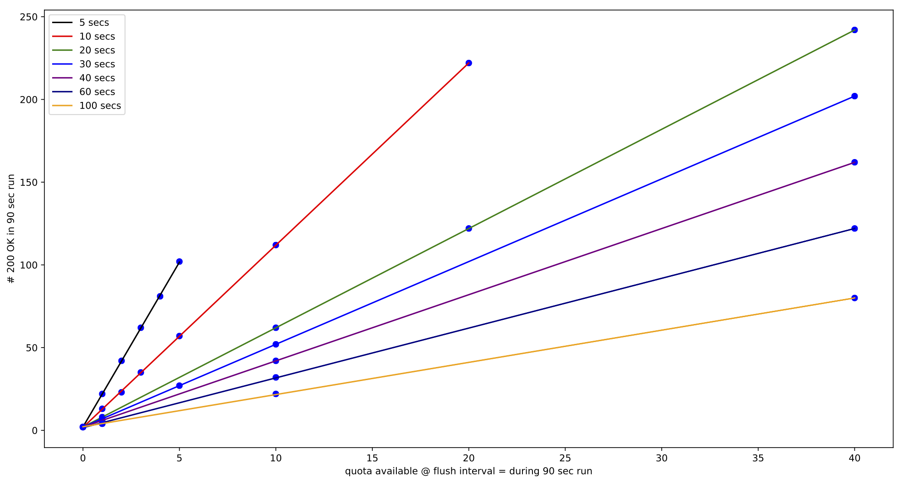
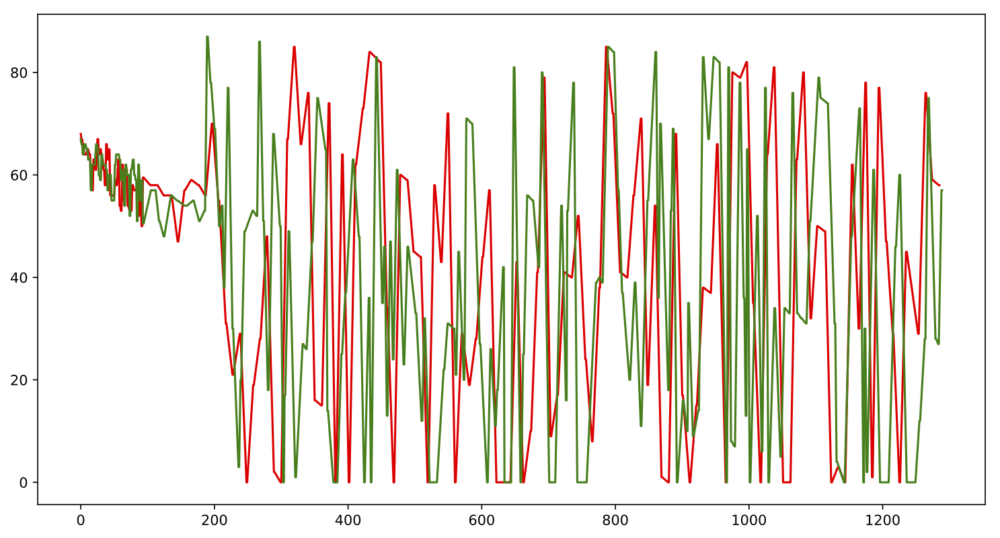

#Apigee and Microgateway Quota Behavior


###Abstract
>A number of issues have been raised in regard to the quality of quota tracking implemented in the Apigee Microgateway. There have been reports of underruns and overruns meaning that some parameters consistently allow far fewer HTTP connections to API services while others consistnently allow too many.  After running a number of tests, we were able to establish that there is a problem with quota tracking and we have identified some of the sources of these problems. In particular, on the Apigee side, the Apigee quota service exhibits an inability to reach a consensus on quota at sub minute request intervals. On the Microgateway side, we can easily create conditions in which the quota tracking will consistenly overrun due to a flaw in the quota plugin implementation.  The report provides details and evidence of these flaws and details the methods used for testing. 


## Overview

We identify Apigee as a the cloud service that provides a centeralized authority for parameters required by the Edgemicro Gaterway. We can call the quota service that provides quota for API product uses Apigee Quota, or AQ for short. We can refer to the Edgemicro Gateway as EMG. We recognize that these are two independent systems. EMG tells AQ the number of connections it uses per API product. And, AQ reports back the number of available connectios left in a time interval given AQ's knowledge of a number of EMG instances intent on sharing the quota count per product.

The Apigee quota system reports the number of available connections when the EMG queries for it. In the current implementation, the EMG will launch a number of worker processes. Each process communicates quota information with the AQ indendently of each other. As such, each worker process will have about the same relationshiop with the AQ no matter which EMG it belongs to. A number of EMG instances will be running on different host instances or pods and each EMG will launch a number of workers. The manner in which an instance of EMG tells the AQ how much quota has been used is to allow the workers to tell the AQ how much quota they have used. The EMG master process merely balances the load of incoming connections to its workers in a round-robin fashionn, the Node.js default.

We can define **available quota** number of connections that the AQ tells a worker in response to a POST indicating the use of previously assigned qutoa. Each EMG worker recieves its version of **available quota** and works for it for a set period of time.

The EMG quota plugin has a ***quota request interval*** or **QRI**. Depending on its setting for expiration, the **QRI** is set to either one minute or five seconds. (Within the plugin the **QR** is called bufferTimout.) If the timeout set in configuration is for a minute, then the **QRI** is five seconds (5 sec). Otherwise, it is one minute (1 min).

Lets get into the presence of the problem. And, then we can consider ways to approach solving it.

## Reports of Problems

Reports of quota problems have been coming in from customer sources fairly consistently. In particular, the Microgateway bug tracking systems has several issues reporting the problem.  Also, the issue was apparent enough for the Google team to request Indraneel Dey to run a battery of tests on the Microgateway in order to attempt a quantification of the quota problem.

#### Issue #139398431 and #139929068

Various reports about overruns have been coming from the customers. 

Issue 139398431 by Robin Decker reports unexpected behavior.
Issues by 139929068 Dhananjay Dalave reports overruns discovered by a customer.

These issues were reported in Aug 2019. But, by that time Indraneel Dey had already been assigned the task of running stress tests agains EMG.

#### Indraneel Dey's Stress Tests

Indraneel Dey was assigned the task of checking the response of the EMG to a particular rate of traffic for different quota settings. He chose to send nine thousand requests per minute (9000req/min) for a period of ten minutes. He then measured the number of allowed connections (those that returned with a status of 200 OK) made relative to the quota, the number of connections allowed during the period of time. 

Indraneel's tests indicate underuns for large levels of quota and overruns for lower levels of quota. The number of underruns decreased only as the quota became large enough to allow through all ninety thousand requests. In fact, there were still underruns when the quota was set to be double the number of requests made during a trial. 

For, the lower levels of quota there were overruns of orders of magnitude greater than the quota amount that was set. The best case scenario allowed two times the quota, while the worst case scenario allowed through over thrity (30) times the the quota.

This a table made by Indraneel Dey for the runs. A column for the difference between the quota and actual success. The green background indicates overrun, and the red text is underrun.


Manaers at Google decided to investigate further based on this information and the reports of customers.


### Two Mistakes Shadowed Real Trouble

The quota system has been used in production. And, while the problems with the quota systems are present, systems functioned within some reasonable envelope of acceptance.  But, this may be that certain default settings allowed two broken quota systems assuage each other's problems.

In particular, at higher rates of quota requests, the AQ is apt to report available quota far lower than it actully is. The EMG is apt to overrun any **available quota** reported to it by the AQ.


### Division of Quota Duties

The EMG and AQ work together to maintain a model of **available quota**. But, they are independent systems that manage **available quota** accoring their own designs. Ether subsystem could be replaced and the other system would operate as it usually does. 

An EMG worker makes a POST request to a URI.  It sends a particular JSON object indicating its current weight (which should be the count of connections made). The worker then recieves a JSON object with two fields ***available*** and ***used***. The EMG work then calculates its idea of **availabl quota** according to what it sees in the ***available** field.  There are a few other fields in the JSON objects indicating products and timestamps and some information about how long the quota ***available*** will be useful.

### Approach to Tests

Since the two systems work indendently, the tests have been constructed to test them separately. 

So, the EMG is tested without making calls to the AQ. Instead, it mocks the AQ and uses ***available*** set fixed for a period of time. The period of time is either the same or at most twice the **QRI**.  In the testing, the EMG was started and stopped for each setting of the ***available*** field and the number of succesful conenections (those reporting a status of 200 OK) was counted. The EMG was set to launch only one worker as there would be no real difference in quota plugin code behavior with more workers and the quota would be easier to observe. Requests were made at a rapid and constant rate in order send enough requests to challenge the quota. Also, the rate was set to be rapid enough to cause the EMG quota plugin to consistently count and check on the **available quota**. 

In order to test AQ, a single program made requests to it at intervals determined by schedules. A schedule could plan for requests at different rates for periods of time. So, some tests could burst requests and then slow down to a steady pace. Other tests could be set to run at a steady rate for the whole test however long it was supposed to be. Various scripts were created to run the tests for one simulated work, two, or more. The ***available*** field sent back by the AQ was gathered and stored with timestamps. Graphs were the drawn diplaying the **available quota**.  Reading the graphs formed the observation of the AQ. 

-------------------------

## Microgateway Quota Behavior

Recall that the EMG launches a number of workers. Each worker calls out to the AQ in order to get a report on the current state of **available quota**. Each worker makes an AQ call at a specific interval determined by the EMG quota plugin. When the worker receives a response to the call, the worker will recieve a JSON structure similar to the one below:

```
{
    allowed: 100,
    used: 90,
    exceeded: 0,
    available: 10,
    expiryTime: 1566422704603,
    timestamp: Date.now() - 200//1566422657647
}
```

The worker will then reset its count and count up to and passed the ***allowed*** field, seen above. The worker will add the ***used*** field to its count and compare that to the ***allowed*** field when determining whether or not to let a connection through to a target server.  (The example is from the mock version of code to call the AQ. And, the timestamp is artificial. The fields are held fixed during a run.)



The figure shows the number of connections allowed through for different levels of quota available.  We see that the EMG quota plugin consistently overruns its quota.  Each line in the figure is determined by the number of seconds that the request interval **QRI** was set to for a set of runs. We can see that the longer the **QRI**, the more similar to the **avaiable quota** and the number of connections allowed through.  In fact, the slope of the line seems to be a function of the **QRI**.

The quota module sets an interval timer and calls the following each time the interval is up.

```
MemoryBuffer.prototype.flushBuffer = function() {
  _.each(this.buckets, function(bucket) {
    bucket.flushBucket();
  });
};
```

That is, for each product being managed by the EMG instance, this will flush the bucket (the counter for that bucket) at then end of each interval. So, if the quotas are calculated by the minute, the end of interval handler will fire every 5 seconds, which is equivalent to twelve times a minute (12 Flush/min).

So, the behavior of flushBucket is important. *flushBucket* sends its count to the AQ. It sets up parameters as follows:
```
  var options = {
    identifier: this.options.identifier,
    weight: this.count
  };
```

That is the basic information going to the AQ. More information is added further down the line. But, this is the product and how much the calling worker has allowed through. 

From there *flushBucket* calls the machinery of the AQ network interface as such:

```
self.owner.spi.apply(options, function(err, reply) {
```

This is a referential path to a method that calls out to the AQ and sends back the result in the *reply* object.  *flushBucket* provides the callback. The callback does a number of things to make sure that it is keeping time and that is looking the same time bucket (not a program construct but the period of time the bucket is supposed to be concerned with). Once it passes these checks, it resets its counter as such:

```
    self.remoteExpires = reply.expiryTime;
    self.remoteCount = reply.used;
    self.count -= options.weight; // subtract applied value

```

Here, you can see that it resets its counter. The weight in the option is the same as self.count usually. Sometimes the count may continue while the EMG worker is waiting for a response from the AQ. So, this may correct for the count rising during communication. But, the amount it rises is fairly random. 

Suffice it to say that whatever count is being set to, the value of *reply.used* will compenstate. So, if the count is always reset to 0, a lower value of *reply.used* will take the place of a rising count. That helps with testing since we can observe the behavior of the EMG worker with a fixed *reply.used*.

When a client request is being processed for quota checking, the bucket is examined to see if a total count is larger than the *allowed* field.

```
  var count = this.count + this.remoteCount;
```

The *MemoryBuffer* object passes this on to a decision making object.

The *remoteCount* is updated periodically. In the mean time, the quota plugin counts from its reset count. The quota plugin allows through all requests until its counter plus the remote count passes the allowed amount. So, theoretically, the counter always resets to zero and there may be any difference between the remote count and the use amount. That is often the case. For example, if there are ten requests allowed in the minute and requests come in at a rate of 10 per second, then in the next five seconds, 50 request will be allowed through if the remote count is 50. The timer will then fire and the count will reset. If the remote count remains 50, another 50 request will be allowed through. And, so on. Yet, the *MemoryBuffer* class will not have a count of how many it allowed through in the minute time frame. So, it will allow through 600 requests in a minute if the remote count does not change even if the configured quota is 100. 

### The Quota Module Can Track Perfectly

Given that the quota module tracks the remote count, one should ask if the quota plugin can allow through exactly its quota amount. It does. 

In another test, the mock code updates the field **reply.used** with the numnber of requests sent through. If no timer is set to reset global counters at the end of an interval, then a run of two minutes will allow through just the configured quota (100/min).  If a timer resets the global counters at the minunte interval, the expected quota (200/min) will be allowed through. 

So, the following code is from the mock:

```
if ( currentUsed >= 0 ) {
    currentUsed += opts.weight;
    currentAvailable -= opts.weight;  
  } else {
    currentUsed = 0;
    currentAvailable = 100;
    setTimeout(() => { currentUsed = -1; currentAvailable = 100; }, 60000)
  }
```

And, this update the mock AQ reply:

```
  var body = {
    allowed: 100,
    used: currentUsed,
    exceeded: 0,
    available: 100 - currentUsed,
    expiryTime: 1566422704603,
    timestamp: Date.now() - 200//1566422657647
   } 
```

So, it is possible that with perfect information from the AQ at the best precise points, that the quota module will track quota appropriately.

But, why is there a need for a timer? Ther is a timer setup buy the quota module to reset th quota buckets at the desired intervals, those configured. And, these tests were set up with a minute interval. 

### Quota Module Expirations are Broken

It turns out that the quota module has some bad code. The function **trimTokens** is called at the expiration interval every time. 

```
function trimTokens(self) {
  var now = _.now();

  for ( var b in Object.keys(self.buckets) ) {
    if (now > b.expires) {
      delete self.buckets.b;
    }
  }
}
```

What this code does: 
> It gets the current time, *now*. Then, it seems to walk a list of bucket keys and uses them to make decisions about deleting buckets. But, it actually walks the keys of an array not an object. So, that the array index b is an integer [0,1,2,...]. Then if looks to see if the integer has an expires field less than *now*. This translates to ```now > 0.expires```.  If the undefined is less, the it attempts to delete a **b** field from the buckets. This would be ```self.buckets.0``` if the translation for the variable worked. But, it does not.  So, even if the loop has been correct, the bucket would still not be delete, since then **b** would be a string. For example, the name of the app might by "HelloWorld". And, the test would then be ```now > "HelloWorld".expires```.
> 

So, **trimToken** has never worked. And, quotas only reset if the AQ sends the beginning of a new interval. 

### trimTokens has no Affect When it Works

The correct way to right **trimToken** is as follows:

```
function trimTokens(self) {
  var now = _.now();

  for ( var bk in self.buckets ) {
  	 var b = self.buckets[bk]
    if (now > b.expires) {
      delete self.buckets[bk];
    }
  }
}
```

When written correctly, the buckets reset. And, then whatever information comes in from the AQ overwrites it. 

So, it is not apparent that there is any need for **trimTokens**.


### Functional Update of Mocked Quota

The mock quotas can be updated with different functions that produce numnbers for **reply.quota**. We tried a few tests. One was a random number generator. The other delays the response to the **options.weight** field. These tests produced overruns.

### More Than One Worker

The discussion given so far has considered the response of just one worker. But, in most cases the EMG is launched with a collection of workers. So, the actual number of connections allowed through can easily be more than allowed through by one, given the amount of traffic.  The point is that each independent worker will receive a quota report at about the same time. And, it will not be divided. So, each worker will receive the same remote count.

In our previous example, given that the remote count is 50 for a period of time, one worker will allow 50 connections through. But, with 8 workers, the number of connections allowed through will be 50 per worker, or 400. So, even with perfectly behaving workers getting current and correct information from the AQ, the EMG will overrun within the first **QRI** interval and keep overrunning until the remote count from the AQ changes.

Now, if the workers queried the AQ at different points in time separated appropriately so that they basically benefit from the report of other workers, then the AQ reports would pull down to more closely to the real quota. But, there is no cooperation between workers of any kind. So, there is no determination as to when workers will query with respect to each other within a single instance or pod let alone with respect to all EMG instance running.

### Discussion

It appears that the quota plugin module has some errorful code that turns out to be moot. Otherwise, it tracks fairly closely whatever comes from the AQ. When communicating with the AQ instead of mocking it, the quota module can keep counting during its request, but attempts to correct for that. Yet, this correction may introduce some randomness into the quota count. Tests with random remote counts tend to produce overruns. And, if the remote count does not update according to the weight sent to the AQ by the quota plugin, then the quotas will surely overrun.  Added to the problems of a single worker, it can easily be the case that a cluster of workers queries the AQ too synchronously and so will therefore overrun even when the workers were perfectly.


-------------------------

## Apigee Quota Behavior

Having looked at the behavior of the Volos Quota Plugin that is released with EMG, we have seen that its behavior is greatly inluenced by the Apigee Quota Service **AQ**. In this section, we can have a look at the behavior of the **AQ** independently of the EMG. 

For these tests, we have created simple clients that do nothing more than query the **AQ** with fixed weights. The clients could be run one or more at a time. Each client recieves a schedule to make calls according to the timing in the schedule.

Here is an example of such a schedule:

```
[[1,10],[900,120]]
```

The schedule shown has two periods of operation one is lasting 10 seconds (second number) and the next is lasting 120 seconds. During a period of operation, the clients make quota requests to the AQ. The first period puts 10 milliseconds between request, and the second puts 900 milliseconds between requests.

>The scheule is an array of arrays. Each array element has two numbers. The first number is the delta time between requests in milliseconds. The second number is the length of time to run at that rate and is expressed in seconds.


Here is how it is invoked in test scripts:

```
node apigeereq-quota.js $qtype '[[1,10],[900,120]]' 'A' >> filenames.txt 
```
This invokation causes one process to run. The process is running a node.js script that is making request to the AQ. The letter on the end identifies the process. More processes can be run in parallel by adding lines and using different letters. For instanceL:

```
node apigeereq-quota.js $qtype '[[1,10],[900,120]]' 'A' >> filenames.txt &
node apigeereq-quota.js $qtype  '[[1,10],[700,120]]' 'B' >> filenames.txt &
```

Each of these requests are put into files. There is a single script that runs the tests and then calls on a small graphing program to display the **available** quota. 

The tests have been arranged into files labeled groups for groups of processes. We can see the results by group. 

### group1

```
# group 1 [10sec @ 0.01, 2 minutes @ > 0.7] 
node apigeereq-quota.js $qtype '[[1,10],[900,120]]' 'A' >> filenames.txt &
node apigeereq-quota.js $qtype  '[[1,10],[700,120]]' 'B' >> filenames.txt &
```



>The graph shows the report of quota taken first at very short intevals followed by a few minutes taken farther apart, approaching a second apart. One should be able to identify the short delta time at the start. The quotas stay within a fairly narrow band. Then at the larger interval of requests, the quotas range widely.

The rolling window version was also requested with this same schedule. But, in this case just one client process was used.


### group1-8

```
# group 1 [10sec @ 0.01, 2 minutes @ > 0.7] 
node apigeereq-quota.js $qtype '[[1,10],[900,120]]' 'A' >> filenames.txt &
node apigeereq-quota.js $qtype  '[[1,10],[700,120]]' 'B' >> filenames.txt &
node apigeereq-quota.js $qtype  '[[1,10],["random",120]]' 'C' >> filenames.txt &
node apigeereq-quota.js $qtype  '[[1,10],[1000,120]]' 'D' >> filenames.txt &
node apigeereq-quota.js $qtype  '[[1,10],[1000,120]]' 'E' >> filenames.txt &
node apigeereq-quota.js $qtype  '[[1,10],[1000,120]]' 'F' >> filenames.txt &
node apigeereq-quota.js $qtype  '[[1,10],["random",120]]' 'G' >> filenames.txt &
node apigeereq-quota.js $qtype  '[[1,10],[2000,120]]' 'H' >> filenames.txt &
```

>The previous test shows two processes running. But, the number of processes in a single pod will often be greater, e.g. eight for eight cores. So, this tests runs eight processes, each one with slightly different schedules. All the schdules start with the same rush, followed by variying intervals. A few are given random inrevals between requests, where this random number is generated after each request responds.

Here are some pictures:


### group2

```
# group 2 [10min @ 1.0]
# ten minutes on one second apart.  group 2
node apigeereq-quota.js $qtype '[[1000,600]]' 'A' >> filenames.txt &
```
>This tests removes the rush. It assumes a steady set of requests spaced one second apart for ten minutes.


### group2-8

```
# group 2 [10min @ 1.0]
# ten minutes on one second apart.  group 2
node apigeereq-quota.js $qtype '[[1000,600]]' 'A' >> filenames.txt &
node apigeereq-quota.js $qtype  '[[1000,600]]' 'B' >> filenames.txt &
node apigeereq-quota.js $qtype  '[[1000,600]]' 'C' >> filenames.txt &
node apigeereq-quota.js $qtype  '[[1000,600]]' 'D' >> filenames.txt &
node apigeereq-quota.js $qtype  '[[1000,600]]' 'E' >> filenames.txt &
node apigeereq-quota.js $qtype  '[[1000,600]]' 'F' >> filenames.txt &
node apigeereq-quota.js $qtype  '[[1000,600]]' 'G' >> filenames.txt &
node apigeereq-quota.js $qtype  '[[1000,600]]' 'H' >> filenames.txt &
```

### group3

```
echo "group 3-2"
# group 3 [1 hour @ 1.0]
# ten minutes on one second apart.  group 2
node apigeereq-quota.js $qtype '[[1000,3600]]' 'A' >> filenames.txt &
node apigeereq-quota.js $qtype  '[[1000,3600]]' 'B' >> filenames.txt &
```


>This tests was run against the QA services within the e2e environment. The test runs for an hour. For a while, the quota reports behave well. They go down in accordance with the weights sent. And, they start again at tthe top each per minute interval. At then end of the run, they go out of control.

Here is another run, but on production as opposed to e2e.

 

> This may indicate a problem with sharing resources in heavier traffic.


### group4-8

```
# group 4 [1 hour @ 300000.0]
node apigeereq-quota.js $qtype '[[300000,4000]]' 'A' >> filenames.txt &
node apigeereq-quota.js $qtype  '[[300000,4000]]' 'B' >> filenames.txt &
node apigeereq-quota.js $qtype  '[[300000,4000]]' 'C' >> filenames.txt &
node apigeereq-quota.js $qtype  '[[300000,4000]]' 'D' >> filenames.txt &
node apigeereq-quota.js $qtype  '[[300000,4000]]' 'E' >> filenames.txt &
node apigeereq-quota.js $qtype  '[[300000,4000]]' 'F' >> filenames.txt &
node apigeereq-quota.js $qtype  '[[300000,4000]]' 'G' >> filenames.txt &
node apigeereq-quota.js $qtype  '[[300000,4000]]' 'H' >> filenames.txt &
#
```


> This is a five minute separation between queries to the AQ.  All the group are fairly well synchronized in terms of quota.


> The rollwing window version also behaves better at five minute intervals.

### group4-8m1

```
# group 4 [1 hour @ 600000.0]
node apigeereq-quota.js $qtype '[[60000,4000]]' 'A' >> filenames.txt &
node apigeereq-quota.js $qtype  '[[60000,4000]]' 'B' >> filenames.txt &
node apigeereq-quota.js $qtype  '[[60000,4000]]' 'C' >> filenames.txt &
node apigeereq-quota.js $qtype  '[[60000,4000]]' 'D' >> filenames.txt &
node apigeereq-quota.js $qtype  '[[60000,4000]]' 'E' >> filenames.txt &
node apigeereq-quota.js $qtype  '[[60000,4000]]' 'F' >> filenames.txt &
node apigeereq-quota.js $qtype  '[[60000,4000]]' 'G' >> filenames.txt &
node apigeereq-quota.js $qtype  '[[60000,4000]]' 'H' >> filenames.txt &
#
```


### group4-8m1long

```
# group 4 [2+ hour @ 600000.0]
node apigeereq-quota.js $qtype '[[60000,8000]]' 'A' >> filenames.txt &
node apigeereq-quota.js $qtype '[[60000,8000]]' 'B' >> filenames.txt &
node apigeereq-quota.js $qtype '[[60000,8000]]' 'C' >> filenames.txt &
node apigeereq-quota.js $qtype '[[60000,8000]]' 'D' >> filenames.txt &
node apigeereq-quota.js $qtype '[[60000,8000]]' 'E' >> filenames.txt &
node apigeereq-quota.js $qtype '[[60000,8000]]' 'F' >> filenames.txt &
node apigeereq-quota.js $qtype '[[60000,8000]]' 'G' >> filenames.txt &
node apigeereq-quota.js $qtype '[[60000,8000]]' 'H' >> filenames.txt &
```


>We ran quotas for more than two hours to see the transition behavior. There is visible bounce, but also there are a few lags that might be mistaken as bounce. At least once client receives spurious data at the end of each hour.


### group4-8m2

```
# group 4 [1 hour @ 1200000.0]
node apigeereq-quota.js $qtype '[[120000,4000]]' 'A' >> filenames.txt &
node apigeereq-quota.js $qtype  '[[120000,4000]]' 'B' >> filenames.txt &
node apigeereq-quota.js $qtype  '[[120000,4000]]' 'C' >> filenames.txt &
node apigeereq-quota.js $qtype  '[[120000,4000]]' 'D' >> filenames.txt &
node apigeereq-quota.js $qtype  '[[120000,4000]]' 'E' >> filenames.txt &
node apigeereq-quota.js $qtype  '[[120000,4000]]' 'F' >> filenames.txt &
node apigeereq-quota.js $qtype  '[[120000,4000]]' 'G' >> filenames.txt &
node apigeereq-quota.js $qtype  '[[120000,4000]]' 'H' >> filenames.txt &
#
```


> This is a two minute test. While five minutes apart between queries seems to be free of bounces. We have seen that one minute is not apart. This two minute chart shows a bounce at the end.

### group4-short

```
# group 4 [10 minutes @ 1.0]
# ten minutes on one second apart.
node apigeereq-quota.js $qtype '[[30000,600]]' 'A' >> filenames.txt &
node apigeereq-quota.js $qtype  '[[30000,600]]' 'B' >> filenames.txt &
```


>We ran the same schedule as group4-8m1long but for a shorter time period to see the bounce more clearly. 

-------------------------

## The QRI Timing Fix and its Drawback

We should keep in mind that with regards to the current implementation of the EMG that workers never synchronize with each other in order to decide when to request quota. Workers never communicate about quota with each other in order to come to a local consensus about quota (where by local, we might uderstand it to be a cloud instance or a pod).

If there is a problem with timing, **QRI**, with regards to AQ figuring **available quota** and reporting it back to a worker, the problem may be propounded by the asyncronous nature of making requests. It may be the case that even if a fixed interval of time, larger than some troublesome interval, allows the AQ to report **available quota** to a single worker or a small number of workers in a group ***A***, which might make requests fairly much in unison, there may still be other groups of workers ***B*** that make requests at fairly short intervals after ***A***. So, the presence of a number of groups of workers will cause **availble quota** reporting to deteriorate into the behavior found to be present with the shorter troublesome interval. One might then reason that it would be good to tell the customer to use fewer workers. But, that might be the same as telling the customer to shut down business. So, it would be best to address the problems and fix them rather than trying to circumnavigate with interval settings.


-------------------------

## Recommendations

The quota sysmtem is broken. Otherwise, EMG client code managing quota might be better written with far less code. Perhaps both client and service quota modules should be rewritten.

For the EMG, ideas about expiration of quotas might be reviewed in the light of customer needs. For instance, setting different quota for different times makes sense. An expiration may just mean that a new quota needs to be introduced in a new time frame, not that a new quota interval is coming into affect. The current code does not function as intended anyway. So, it bears no relation to any popular or common quota algorithms that are known.

It may be possible to simply run the QA side of things much more slowly, where by slowly, we mean that is will queried far less often. In that case, a different quota plugin arcitecture may be needed to manage quotas at a smaller scale.

-------------------------


## Conclusions

We have looked closely at the performance of the Apigee quota service from blackbox client perspective. Requesting quotas less frequently may help with making quotas reflect the true state of use of API's. But, because loads of use differe unpredictably, we may not be sure that adjusting time parameters will solve the quota problem. However, if adjusting time parameters does help, we are not sure that the current quota plugin has the right architecture for using the adjusted quota service. The EMG quota plugin may have to be replaced with simpler code with a different architecture.


